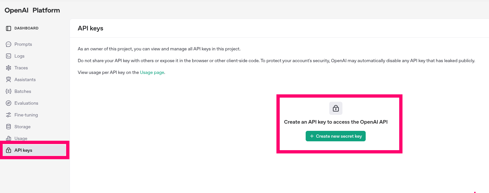
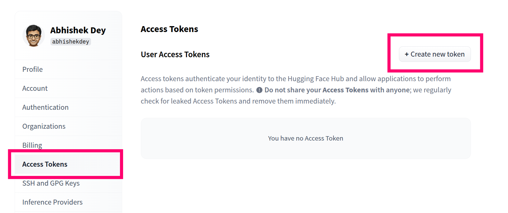
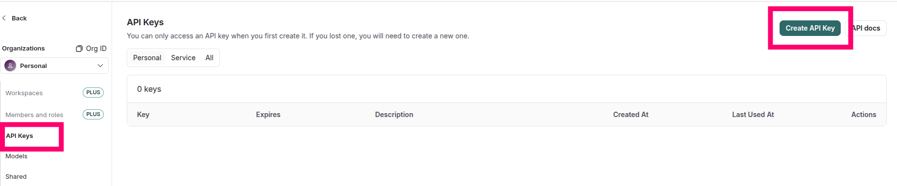

## LLM Projects

This repo contains projects related to large language models

## Getting Started:

To get started with building and monitoring LLM applications:

* Create accounts on **OpenAI**, **Hugging Face**, and **LangSmith**.

* Obtain API keys from each platform.

* Use these keys to set up and monitor your model API calls.

### Open-AI

* Create account in [OpenAI](https://platform.openai.com/api-keys)

* Click on **Create new secret key**

<p align="left">

</p>


### Note:

* Make sure you add atleast **$5** to able to access the open-ai models

* Use [this link](https://platform.openai.com/settings/organization/billing/overview) to recharge

* You can monitor the api calls usage [here](https://platform.openai.com/usage)

### Hugging Face

* Create account in [Hugging-Face](https://huggingface.co/login)

* Go to **settings** -> **Access Tokens**
   
* Click on **Create new token**

<p align="left">

</p>

### Lang Smith

* Create account in [LangSmith](https://smith.langchain.com/)

* Go to **settings**

* Click on **Create API Key**

<p align="left">

</p>

## Setup your environment variables in bashrc

* export environment variables 

```
echo "export OPENAI_API_KEY='<your-openai-api-key>'" >> ~/.bashrc
echo "export HF_TOKEN='<your-hugging-face-token>'" >> ~/.bashrc
echo "export LANGSMITH_TRACING=true" >> ~/.bashrc
echo "export LANGSMITH_API_KEY='<your-langsmith-api-key>'" >> ~/.bashrc

```

* source bashrc


```
source ~/.bashrc

```

## Check your environment variables in python 


```

import os


openai_api_key = os.environ["OPENAI_API_KEY"]
hugging_face_token = os.environ["HF_TOKEN"]
langsmith_api_key = os.environ["LANGSMITH_API_KEY"]
langsmith_tracing = os.environ["LANGSMITH_TRACING"]


print(f"Open-AI API key : {openai_api_key}")
print(f"Hugging-Face Access Token : {hugging_face_token}")
print(f"LangSmith API key : {langsmith_api_key}")
print(f"LangSmith tracking : {langsmith_tracing}")


```
