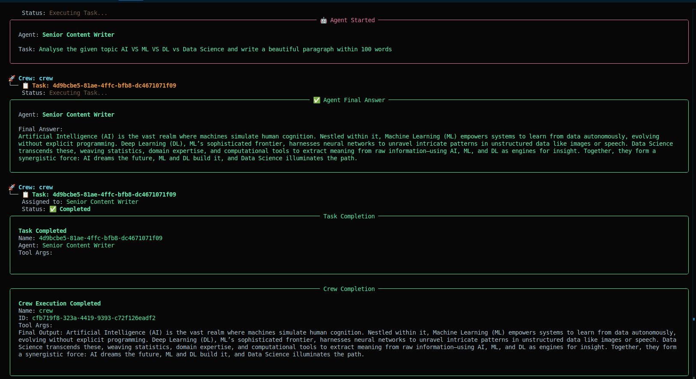

## Agentic AI project with single Agent using CrewAI

**Author: Abhishek Dey**

## About:

In this project, an Agentic AI application is developed considering a single AI Agent, **content_writer**. The task of the content writer is to analyse the topic given by end user and write a content on the same with in 100 words.

## Environment setup

```
conda create -n crew_env python=3.13

conda activate crew_env

pip3 install -r requirements.txt
```

## Step 1: Load environment variables and LLM model 

* Load environment variables in [Agents.py](Agents.py)

```
import os

os.environ["HF_TOKEN"]

```

* Load LLM model

```
from crewai import LLM, Agent

llm = LLM(
    model="huggingface/together/deepseek-ai/DeepSeek-R1",
    temperature=0.1
)

```

## Step 2: Create an AI Agent

* Here I am creating an [AI agent](Agents.py) : **content_writer**

```
from crewai import Agent


content_writer_agent=Agent(

    role="Senior Content Writer",
    goal="Write a beutiful paragraph on the given topic {topic} within 100 words",
    backstory="A highly experienced Content Writer expertised in summarizing any given topic within given word limit",
    llm=llm,
    verbose=True,
    memory=True,
    allow_delegation=False

)

```

## Step 3: Create a Task for the AI Agent

* Here I am creating a [Task](Tasks.py) : **content_writing**

```
from crewai import Task
from Agents import content_writer_agent


content_writing=Task(

    description="Analyse the given topic {topic} and write a beautiful paragraph within 100 words ",
    expected_output="A summarized paragraph on the given topic {topic} within 100 words",
    agent=content_writer_agent

)

```

## Step 4: Connect the AI Agent with the task using crew

* Here I am creating a [crew](Crew.py) as below

```
from Agents import content_writer_agent
from Tasks import content_writing
from crewai import Crew


crew=Crew(

    agents=[content_writer_agent],
    tasks=[content_writing],
    verbose=True

)

```

## Step 5: Kickoff the crew

```

result=crew.kickoff(inputs={'topic':'AI VS ML VS DL vs Data Science'})

```


## Run crew

```
python3 Crew.py

```

## Output

<p align="left">
>
</p>


## References:

1. [Code Basics : CrewAI Tutorial](https://www.youtube.com/watch?v=G42J2MSKyc8&t=1849s&pp=ygUHY3JldyBhaQ%3D%3D)

2. [Krish Naik : CrewAI Crash Course](https://www.youtube.com/watch?v=UV81LAb3x2g)

3. [CrewAI Official Documentation](https://docs.crewai.com/en/introduction)
