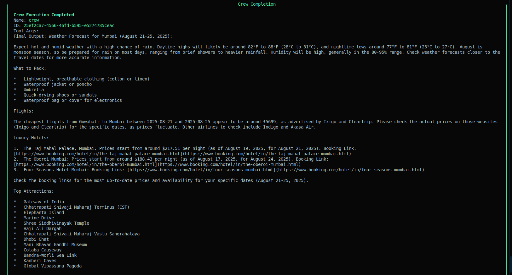

## Trip Planner Agentic AI project using Crew-AI

**Author: Abhishek Dey**

## About:

In this project, a Multi Agent Agentic AI application is developed for planning a trip. 

### Inputs:

* **source** : City from where the person will board the flight

* **destination** : City where the person will visit

* **start_date** : starting date of the trip

* **return_date** : returning date to the source city

### Expected Outputs:

* Cheapest flight price between source and destination city in the given date range

* Top 3 luxury hotel rates in the city of visit

* Weather forcast and what recommendations for what to pack

* Top attractions to visit in the destination city


### Agents:

1. **flight_agent** : Agent to find the best flight deals and schedules using online search

2. **hotel_agent** : Agent to find the top 3 luxury hotels at destination between start_date and return_date

3. **travel_guide_agent** : Agent to suggest the top attractions near destination

4. **weather_agent** : Agent to check the weather in destination between start_date and return_date and suggest what to carry


### Tasks:

1. **flight_search_task** : Task to search for the cheapest flights from source to destination between start_date and return_date

2. **hotel_search_task** : Task to search for the top 3 luxury hotels in destination between start_date and return_date

3. **destination_recommendation_task** : Task to provide top attractions near destination

4. **weather_advisory_task** : Task to check the weather in destination between start_date and return_date and suggest what to carry

## Environment setup

```
conda create -n crew_env python=3.12

conda activate crew_env

pip3 install -r requirements.txt

pip3 install 'crewai[tools]'

```

## Step 1: Load environment variables, LLM model and initialize SerperDevTool 

* Load environment variables in [Tools.py](Tools.py)

```
import os

os.environ["SERPER_API_KEY"]
os.environ["GEMINI_API_KEY"]

```

* Load LLM model using [google-gemini-api](https://docs.crewai.com/en/concepts/llms#google-gemini-api)

```
from crewai import LLM

llm = LLM(
    model="gemini/gemini-2.0-flash",
    temperature=0.7,
)

```

* Initialize [SerperDevTool](https://docs.crewai.com/en/tools/search-research/serperdevtool) 

```
serper_tool = SerperDevTool(n_results=10)

```


## Step 2: Create AI Agents

* Here I am creating [AI Agents](Agents.py) 

## Step 3: Create Tasks for the AI Agent

* Here I am creating [Tasks](Tasks.py) 

## Step 4: Connect the AI Agent with the task using crew

* Here I am creating a [Crew](Crew.py) 

## Step 5: Kickoff the crew

```
result = crew.kickoff(inputs={
    'source': "Guwahati",
    'destination': "Mumbai",
    'start_date': "2025-08-21",
    'return_date': "2025-08-25"
})

```


## Run crew

```
python3 Crew.py

```

## Output

<p align="left">

</p>


## References:

1. [Code Basics : CrewAI Tutorial](https://www.youtube.com/watch?v=G42J2MSKyc8&t=1849s&pp=ygUHY3JldyBhaQ%3D%3D)

2. [Krish Naik : CrewAI Crash Course](https://www.youtube.com/watch?v=UV81LAb3x2g)

3. [CrewAI Official Documentation](https://docs.crewai.com/en/introduction)
