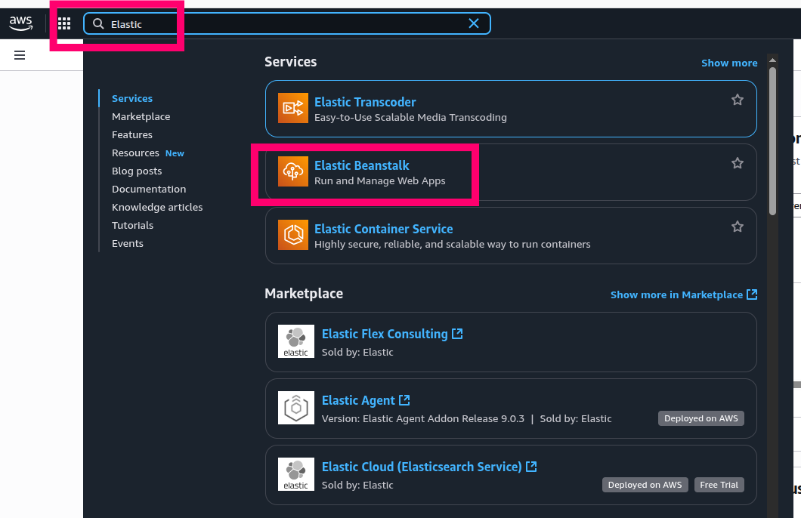
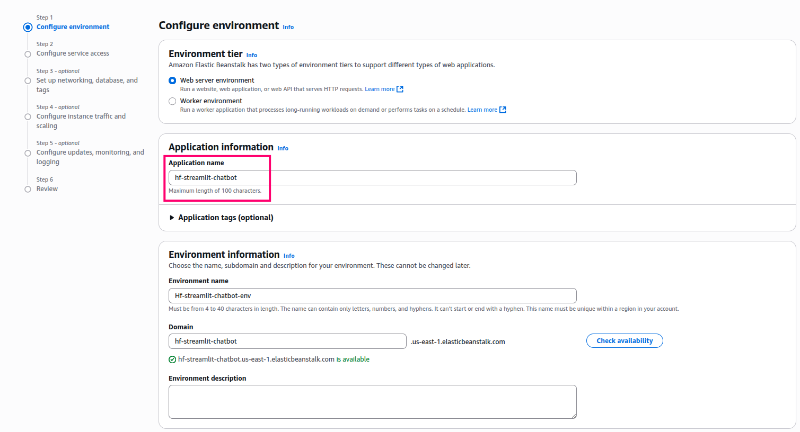
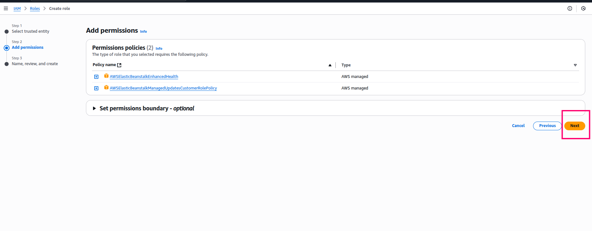
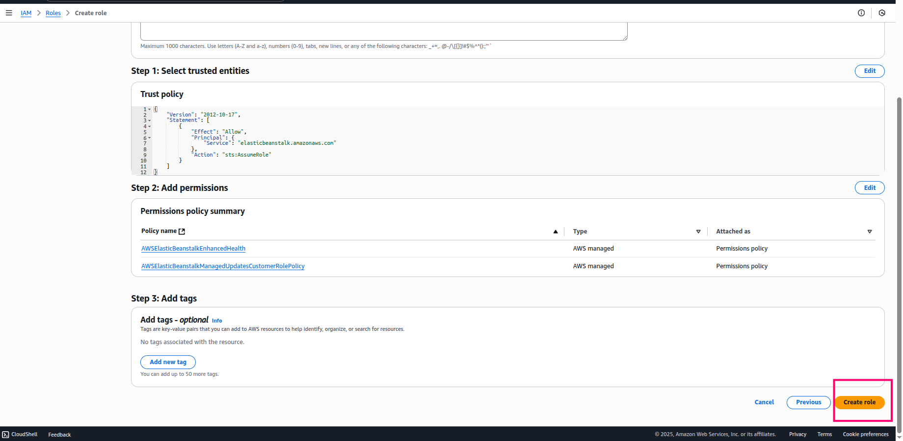
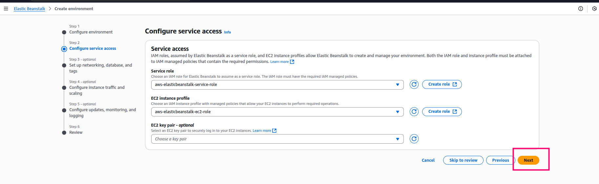
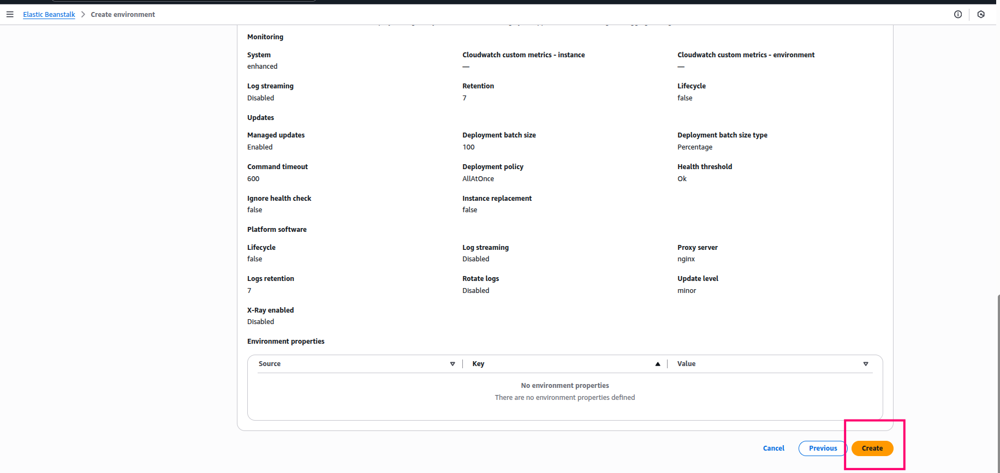
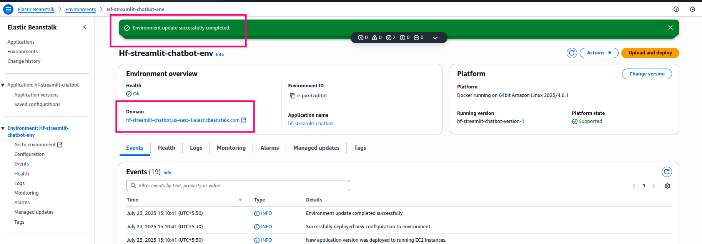
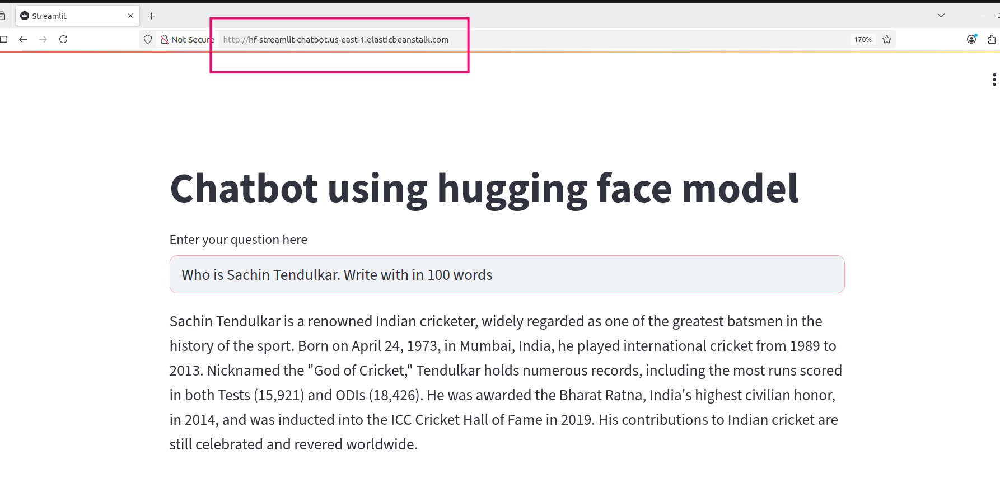
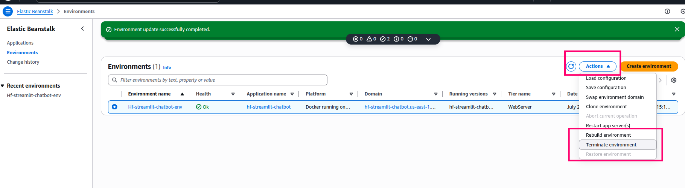
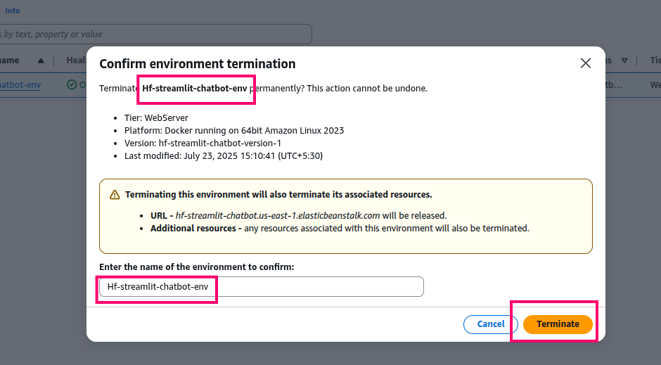

## Deployment in AWS

**Author: Abhishek Dey**

## About:

Here we will see how to deploy the HuggingFace model based Streamlit chatbot application in AWS using docker.

## Pre-requisite:

* AWS Account

## Step-1: Add the below modifications : 


* Create **.env** file. Add your environment variables in **.env** file

* **NOTE:** Make sure you don't add quotes ('hf_xx') in the tokens 

```

HF_TOKEN=hf_xxxxxxxxxxxxxxxxxxxxxxxxxxx
LANGSMITH_TRACING=true
LANGSMITH_API_KEY=lsv2_xxxxxxxxxxxxxxxxxxxxxxxxxx

```

* Add **python-dotenv** in the requirements.txt file

* Add the below two lines in **app.py** to load the environment variables from **.env** file

```
from dotenv import load_dotenv
load_dotenv()

```

* Add the hugging_face_token as below in the **app.py**


```
hf_endpoint = HuggingFaceEndpoint(
    repo_id="meta-llama/Llama-3.1-8B-Instruct",
    task="text-generation",
    max_new_tokens=512,
    do_sample=False,
    repetition_penalty=1.03,
    provider="auto",  
    huggingfacehub_api_token=hugging_face_token # add this line
)

```

## Step-2: Login to AWS Manangement Console

* Sign In as [Root user](https://signin.aws.amazon.com/signin?client_id=arn%3Aaws%3Asignin%3A%3A%3Aconsole%2Fcanvas&redirect_uri=https%3A%2F%2Fconsole.aws.amazon.com%2Fconsole%2Fhome%3FhashArgs%3D%2523%26isauthcode%3Dtrue%26nc2%3Dh_si%26src%3Dheader-signin%26state%3DhashArgsFromTB_eu-north-1_6e05766ac7e8b412&page=resolve&code_challenge=pa7LMuI9Uv1v9j3ZjDiS5ZsIViiKsTm5XrW_rN1jWy8&code_challenge_method=SHA-256&backwards_compatible=true)


<p align="left">

</p>


* Once you enter into AWS account, search for **Elastic Beanstalk**

<p align="left">

</p>

* Click on **Create application**

<p align="left">

</p>


## Step-3 Setup configurations

* In configure environment, write the **Application Name**

<p align="left">

</p>

* Click of **next**

<p align="left">

</p>

* In **Service role** section, click on **create role** and click on **next -> next -> Create role** 

<p align="left">

</p>


<p align="left">

</p>

<p align="left">

</p>

* Finally **aws-elasticbeanstalk-service-role** is created

<p align="left">

</p>


* Similarly in **EC2 instance profile**, Click on **create role** and click on **next -> next -> Create role**  

* **aws-elasticbeanstalk-ec2-role** is created

<p align="left">

</p>

 
* Click on **next -> next** to keep default settings for the **optional configurations step 3-5**

<p align="left">

</p>

* Finally you launch into the **Review** section

<p align="left">

</p>

* Scroll down and click on **create**

<p align="left">

</p>


* Around 3-4 minutes will be taken to **create the environmment.**


## Step-4: zip the required files

```

zip hf_streamlit_chatbot.zip app.py Dockerfile requirements.txt .env

```

## Step-5: Upload and deploy

* Upload the **hf_streamlit_chatbot.zip** file in the **Upload and deploy** section

<p align="left">

</p>


<p align="left">

</p>

* Finally deployment is completed

<p align="left">

</p>

* Click on the **Domain** link to access the streamlit app in the browser

<p align="left">

</p>


## Step-6: Terminate environment

* Once you are done with the application, don't forget to **termintate** the environment

<p align="left">

</p>


<p align="left">

</p>
