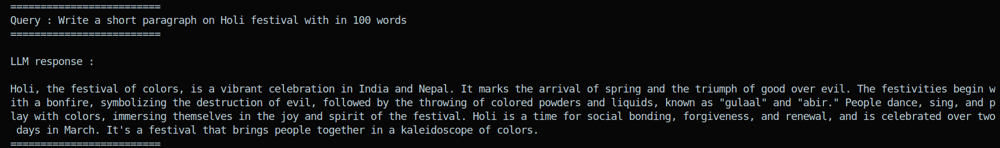
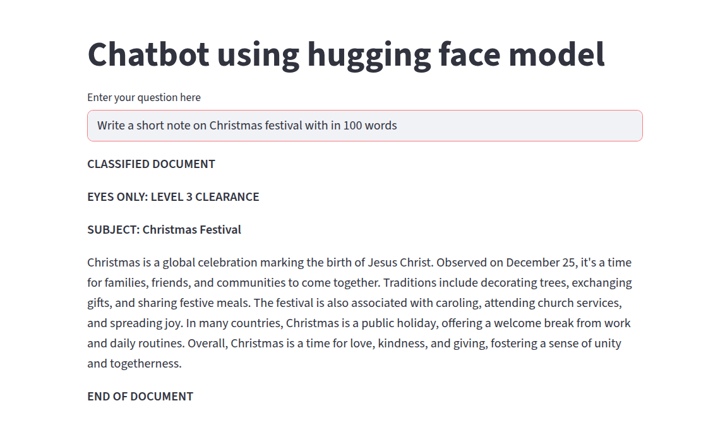

## Simple chatbot using Hugging Face

**Author: Abhishek Dey**

## Run as a Python script:

```
python3 dev.py --model "meta-llama/Llama-3.1-8B-Instruct" --query "Write a short paragraph on Holi festival with in 100 words"

```

<p align="left">

</p>

## Run as Streamlit GUI

```
streamlit run app.py

```

<p align="left">

</p>


## Langsmith Tracing

<p align="left">

</p>
