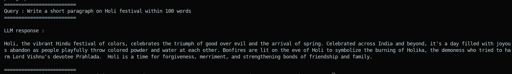
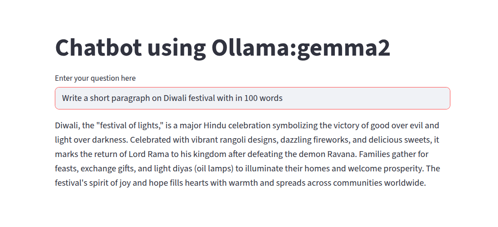
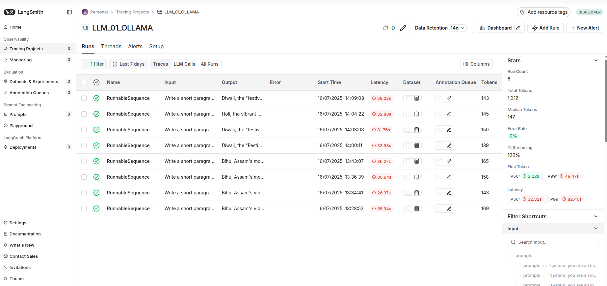

## Simple chatbot using Ollama

**Author: Abhishek Dey**

## Getting started:

* Install ollama 

```
curl -fsSL https://ollama.com/install.sh | sh

```

* Pull Ollama model

```
ollama pull gemma2:latest

```

* To see the list of ollama models downloaded in the machine

```
ollama list

```

```
llama3.2-vision:latest     085a1fdae525    7.9 GB    5 months ago    
phi3.5:latest              61819fb370a3    2.2 GB    6 months ago    
gemma2:latest              ff02c3702f32    5.4 GB    6 months ago    
llama3.2:latest            a80c4f17acd5    2.0 GB    7 months ago    
qwen2m:latest              cafefbb36822    4.4 GB    7 months ago    
qwen2:latest               dd314f039b9d    4.4 GB    7 months ago    
nomic-embed-text:latest    0a109f422b47    274 MB    7 months ago    
mistral:latest             f974a74358d6    4.1 GB    7 months ago

```

## Run as a Python script:

```
python3 dev.py --model "gemma2:latest" --query "Write a short paragraph on Holi festival with in 100 words"

```

<p align="left">

</p>

## Run as Streamlit GUI

```
streamlit run app.py

```

<p align="left">

</p>


## Langsmith Tracing

<p align="left">

</p>
