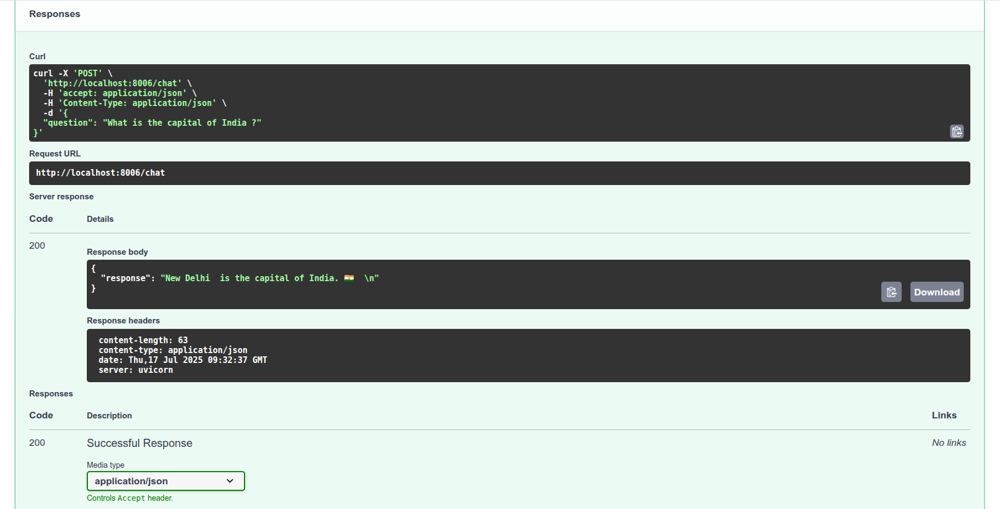

## Chatbot API using FastAPI

**Author: Abhishek Dey**

## About:

Here we create an API in the server side and access the API endpoint using streamlit based GUI in the client side.

## Run the server using uvicorn:

* Make sure you are inside the **api** folder

```
cd api

```
* Then start the server using uvicorn. You may change the host and port numbers

```
uvicorn server:app --reload --host 0.0.0.0 --port 8006

```

* Open **http://0.0.0.0:8006** in the browser. You should see as below

<p align="left">

</p>


* Route to  **http://0.0.0.0:8006/docs** in the browser. You should see as below

<p align="left">

</p>

* You can test the API here like


<p align="left">

</p>

* Here is the response from the API. It hits the LLM model and gets the answer

<p align="left">

</p>


## Run Streamlit GUI as client:

```
streamlit run client.py 

```

* This is how the **server-side (left)** and **client-side (right)** looks in the terminal

 
<p align="left">

</p>


* Streamlit GUI should open in the browser or else click on the local host link shown in terminal

<p align="left">

</p>


